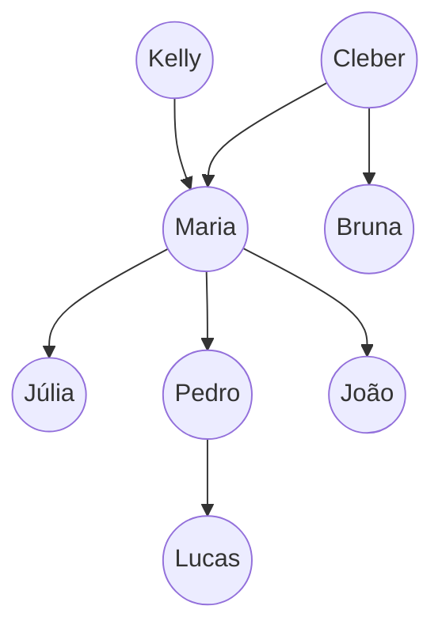

## Executar o SWI-Prolog

```shell
$ swipl

?- consult(NOME_DO_ARQUIVO).
?- ['NOME_DO_AQRUIVO'].

Ex:
?- consult(exemplo1). #carrega o arquivo exemplo1.pl
?- ['exemplo1'].
```


## Exemplo 1



```bash
# Fatos ou Base de Conhecimento
gerou(kelly,maria).
gerou(cleber,maria).
gerou(maria,julia).
gerou(maria,pedro).
gerou(maria,joao).
gerou(pedro,lucas).

feminino(kelly).
feminino(maria).
feminino(julia).
feminino(bruna).
masculino(cleber).
masculino(pedro).
masculino(lucas).
masculino(joao).
```

```bash
# Rodar durante a apresentação

gerou(maria,kelly).
#false
gerou(kelly,maria).
#true

gerou(X,maria). # Para saber quem gerou maria

gerou(X,Y).     # Mostra quem gerou quem
				# Para exibir a próxima iteração, utilizar ';'
			
masculino(X). 	# Todos as pessoas do sexo masculino
feminino(Y).	# Todas as pessoas do sexo feminino
```


## Exemplo 2


```bash
# Fatos ou Base de Conhecimento
gerou(kelly,maria).
gerou(cleber,maria).
gerou(maria,julia).
gerou(maria,pedro).
gerou(maria,joao).
gerou(pedro,lucas).

feminino(kelly).
feminino(maria).
feminino(julia).
feminino(bruna).
masculino(cleber).
masculino(pedro).
masculino(lucas).
masculino(joao).

# Regras
filho(Y, X) :-
	gerou(X,Y).
	
filho_masculino(X,Y) :-
        gerou(Y,X),
        masculino(X).
        
mae(X,Y) :-
	gerou(X,Y),
	feminino(X).
	
pai(X,Y) :-
	gerou(X,Y),
    masculino(X). 
	
avo(X, Z) :-
	gerou(X, Y),
	gerou(Y,Z).
```

